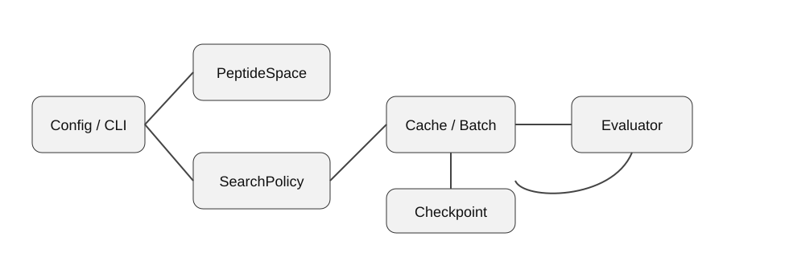
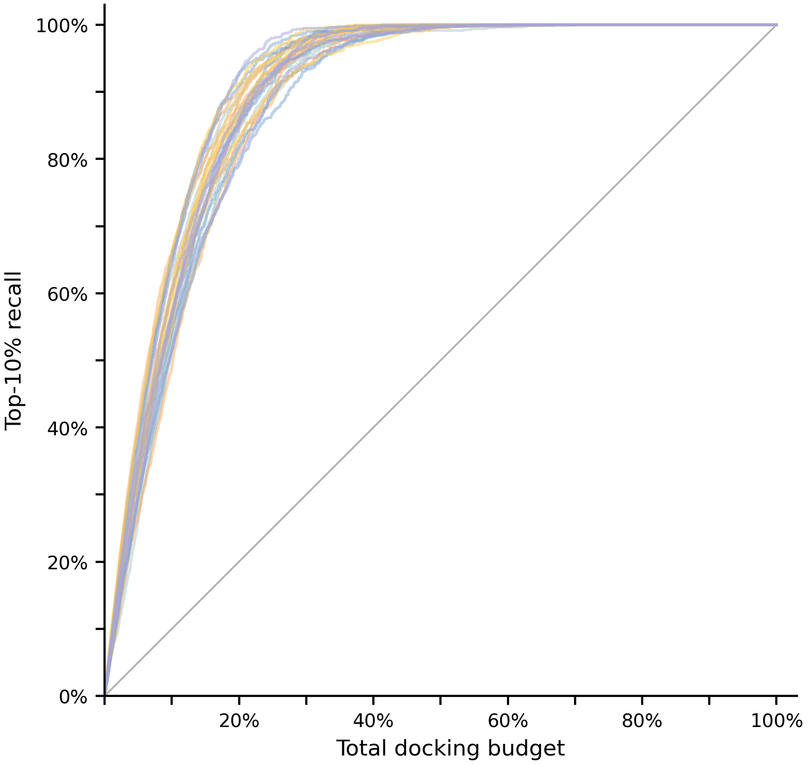
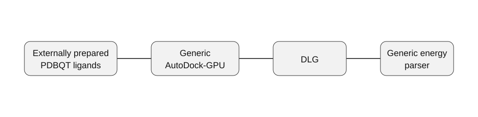

# GAPD

**Genetic-algorithm-inspired peptide sequence search for expensive black-box evaluation.**

> [!IMPORTANT]
> **Public Release / Privacy-Preserving Demo**
>
> This repository is a privacy-preserving public demonstration of GAPD. Research-specific algorithms, parameters, experimental configurations, real targets, candidate data, detailed/raw results, and other unpublished research components are intentionally withheld. One aggregate public benchmark snapshot is provided below.
>
> The code in this repository is a standalone demonstration implementation. It is intentionally separated from the unpublished research implementation and must not be interpreted as a reconstruction of that implementation.

> [!IMPORTANT]
> **公开版本 / 隐私保护演示**
>
> 本仓库是 GAPD 的隐私保护公开演示版本。研究专用算法、参数、实验配置、真实靶点、候选数据、详细/原始研究结果及其他未公开科研内容均被有意保留在公开仓库之外。下方仅公开一项汇总层面的性能结果。
>
> 本仓库代码是独立的演示实现，与未发表科研实现刻意隔离，不应被视为真实研究实现的重构版本。

## Overview

GAPD demonstrates a modular peptide-search workflow in which a search policy proposes sequences and an evaluator assigns scores. The public package contains an independent, textbook-style genetic policy, deterministic synthetic evaluation, optional generic AutoDock-GPU integration for externally prepared ligands, score caching, checkpoint/resume, a CLI, tests, and documentation.

The demonstration genetic policy is deliberately simple: it maintains evaluated candidates, samples ordinary parent pairs, performs a basic one-point crossover, applies random single-position mutation, and prevents duplicate proposals. It is an independent teaching implementation and does not reproduce unpublished research-specific search logic.

## Architecture



The public pipeline is intentionally small:

`Config → PeptideSpace → SearchPolicy → cache/deduplication → Evaluator → policy update → checkpoint`

See [docs/architecture.md](docs/architecture.md) and [docs/research_boundary.md](docs/research_boundary.md).

## Features

- configurable peptide sequence spaces
- independent demonstration genetic search policy
- random-search baseline
- deterministic synthetic evaluator
- optional generic AutoDock-GPU adapter
- generic DLG energy parser
- persistent score cache
- checkpoint/resume
- reproducible seeded execution
- CLI and YAML configuration
- automated tests and CI

## Public benchmark snapshot

At **20% of the original total docking budget**—equivalent to an **80% reduction in docking evaluations**—the **recall of the Top-10% molecules reaches 86.13%**. The figure below is the public aggregate performance snapshot; underlying raw benchmark data and unpublished research details are not included.



## Installation

```text
python -m pip install -e .
```

## Quick Start

```text
gapd --version
gapd demo --config examples/toy_config.yaml
gapd run --config examples/toy_config.yaml
```

The toy example writes public-demo state under `work/toy/`. All example values are synthetic demonstration settings and are not tuned research parameters.

## Public demonstration policies

### `SimpleGeneticPolicy`

A deliberately generic teaching implementation using random parent selection, one-point crossover, random single-position mutation, duplicate filtering, and a deterministic fallback over the sequence space.

### `RandomSearchPolicy`

A seeded random baseline with duplicate filtering.

Neither policy contains unpublished research-specific logic.

## Evaluators

### `ToyEvaluator`

Produces deterministic synthetic scores from the sequence and a seed. No molecular docking software is required.

### `AutoDockGPUEvaluator`

Consumes **externally prepared** ligand PDBQT files, invokes a generic AutoDock-GPU command, and parses generic DLG binding-energy lines. Research-specific molecular preparation, evaluation settings, and experimental configurations are intentionally outside the public package.



## Repository structure

```text
gapd/                 public demonstration implementation
gapd/policies/        independent demo search policies
gapd/evaluators/      synthetic and generic external evaluators
gapd/pipeline/        runner, state, and checkpoint logic
examples/             synthetic public YAML examples
docs/                 architecture, design, and research boundary
tests/                behavior tests
.github/workflows/    CI
```

## Testing

```text
python -m compileall gapd
pytest -q
```

## Public and research boundary

The public repository includes software interfaces, generic engineering components, and the aggregate benchmark snapshot shown above. Research-specific algorithms and implementation details, parameters and experimental configurations, real molecular targets, candidate data, detailed/raw results, and raw research data remain private.

The public code is intentionally separated from the unpublished research implementation and is not intended to reproduce or reveal it.

## Usage and rights

No open-source license is currently granted. All rights are reserved.

---


---

# 中文版本

**GAPD：基于遗传算法启发的多肽序列搜索（隐私保护公开演示版）。**

> [!IMPORTANT]
> **公开版本 / 隐私保护演示**
>
> 本仓库是 GAPD 的隐私保护公开演示版本。研究专用算法、参数、实验配置、真实靶点、候选数据、详细/原始研究结果及其他未公开科研内容均被有意保留在公开仓库之外。下方仅公开一项汇总层面的性能结果。
>
> 本仓库代码是独立的演示实现，与未发表科研实现刻意隔离，不应被视为真实研究实现的重构版本。

## 项目概述

GAPD 展示一个模块化的多肽序列搜索工作流：搜索策略负责提出候选序列，评价器负责为候选序列返回分数。公开版本包含独立、教科书式的遗传搜索策略、确定性的合成评价器、可选的通用 AutoDock-GPU 适配器（面向外部已准备好的配体）、score cache、checkpoint/resume、命令行接口、自动化测试以及配套文档。

公开演示中的遗传策略被刻意简化：维护已经完成评价的候选，从中普通地随机抽取亲本，执行基础单点交叉，再进行随机单位置突变，同时避免重复提出相同候选。它是独立的教学式实现，不复现未发表的研究专用搜索逻辑。

## 软件架构


公开版本的主流程被有意保持为较小、通用的结构：

`Config → PeptideSpace → SearchPolicy → cache/deduplication → Evaluator → policy update → checkpoint`

更详细的架构说明可见 [docs/architecture.md](docs/architecture.md) 与 [docs/research_boundary.md](docs/research_boundary.md)。

## 主要功能

- 可配置的多肽序列搜索空间
- 独立的演示版遗传搜索策略
- 随机搜索基线
- 确定性的合成评价器
- 可选的通用 AutoDock-GPU 适配器
- 通用 DLG 能量解析器
- 持久化 score cache
- checkpoint / resume
- 基于 seed 的可复现执行
- CLI 与 YAML 配置
- 自动化测试与 CI

## 公开性能结果

在**原始总对接预算的 20%** 条件下，即**减少 80% 的对接计算预算**，**Top-10% 分子的召回率可达 86.13%**。下图仅作为公开的汇总性能展示，原始 benchmark 数据及其他未公开科研细节不包含在本仓库中。


## 安装

```text
python -m pip install -e .
```

## 快速开始

```text
gapd --version
gapd demo --config examples/toy_config.yaml
gapd run --config examples/toy_config.yaml
```

Toy 示例会把公开演示状态写入 `work/toy/`。示例中的所有数值都只是合成演示设置，不代表经过调优的真实科研参数。

## 公开演示策略

### `SimpleGeneticPolicy`

这是一个刻意保持通用、适合演示的软件实现，只使用随机亲本选择、单点交叉、随机单位置突变、重复过滤，以及在需要时对序列空间执行确定性的 fallback。

### `RandomSearchPolicy`

这是一个基于固定 seed 的随机搜索基线，同样包含重复过滤。

上述两个公开策略均不包含未发表的研究特定逻辑。

## 评价器

### `ToyEvaluator`

根据候选序列与 seed 生成确定性的合成分数，不需要安装或运行任何分子对接软件。

### `AutoDockGPUEvaluator`

接收**由外部预先准备好的**配体 PDBQT 文件，调用通用 AutoDock-GPU 命令，并解析通用 DLG binding-energy 记录。研究专用的分子准备、评价设置与实验配置均被有意排除在公开包之外。


## 仓库结构

```text
gapd/                 公开演示实现
gapd/policies/        独立的演示搜索策略
gapd/evaluators/      合成评价器与通用外部评价器
gapd/pipeline/        runner、状态管理与 checkpoint 逻辑
examples/             合成的公开 YAML 示例
docs/                 架构、设计与科研边界说明
tests/                行为测试
.github/workflows/    CI
```

## 测试

```text
python -m compileall gapd
pytest -q
```

## 公开与私有边界

公开仓库保留软件接口、通用工程组件，以及上方展示的一项汇总性能结果。研究专用算法及实现细节、参数与实验配置、真实分子靶点、候选数据、详细/原始研究结果以及原始科研数据均保持私有。

公开代码与未发表科研实现经过有意隔离，不用于复现或揭示真实研究实现。

## 使用与权利说明

当前未授予开源许可证（open-source license）。保留所有权利。

